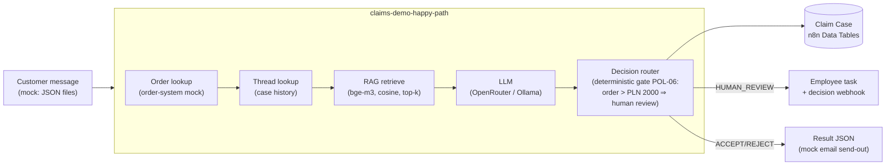

# n8n Claims Automation — AI-powered complaint handling engine

> **🇵🇱 Wersja polska:** [README.md](README.md)

A demonstration **e-commerce complaint automation engine** built entirely on
[n8n](https://n8n.io): LLM-based triage and resolution, human-in-the-loop,
RAG over policies and precedents, and **two independent evaluation paths**
with metrics and A/B experiments.

The project covers the full engineering cycle: domain design → test dataset
authored by an isolated agent → walking skeleton → layered features (Claim
Case history, human review, follow-ups, RAG) → evaluation → experiments.

## What this study is about

The engine reads a customer message, checks it against the store's policy and
makes one of three decisions: **accept**, **reject**, or **escalate to a human**.
"Workflow works" alone means little — the key question is: **are the decisions
consistent with the policy?** That's why 40 sample complaints with known correct
answers were created, and the project measures how often the engine decides the
same way a human who knows the rules would.

Three research questions:

1. Does AI decide consistently with the policy when it sees the whole policy?
2. Is it enough to show AI only matching policy fragments (the RAG technique —
   what large organizations do when full documentation doesn't fit in a prompt)?
3. Does showing more fragments (6 → 10) improve the result?

## Results

| What the AI knew when deciding | Result |
|---|---|
| Full policy (12 rules + 10 precedents) | **95%** (38/40) |
| Only 6 most similar fragments (RAG) | 82.5% (33/40) |
| Only 10 most similar fragments (RAG) | 85% (34/40) |

Run artifacts: [`datasets/outbox/`](datasets/outbox/) (`eval-run-*.json`),
change log: [`datasets/CHANGES.md`](datasets/CHANGES.md) (Polish).

### Takeaways

1. **AI handles complaints well when it sees the whole policy** — 95% agreement
   with ground truth. Mistakes happen mainly in borderline cases where even a
   human might hesitate.

2. **Showing only policy fragments (RAG) costs ~10 percentage points.** With
   this policy size it brings no benefit: since everything fits in the prompt,
   cutting fragments can only hurt — a needed rule may not make the cut.

3. **More fragments don't help.** Top-6 and top-10 give practically the same
   result, so "too little context" is not the problem.

4. **Recurring mistakes always concern the same few borderline cases** — the
   model oscillates. This is normal model variance, so conclusions are drawn
   from recurring patterns, not single numbers.

5. **The tests also caught a defect in the input data itself.** The first run
   showed some complaints lacked facts needed for a decision (e.g. product
   price) — which a real customer wouldn't provide anyway. Fixed like a real
   company would: the engine enriches data from the order system instead of
   "fixing" expected answers.

Detailed analysis: [`docs/EKSPERYMENTY.en.md`](docs/EKSPERYMENTY.en.md)
([polska wersja](docs/EKSPERYMENTY.md)).

## Architecture



Key design decisions:

- **Decision router with deterministic gates** — business thresholds (e.g. order
  value) enforced in code regardless of the model recommendation. The LLM
  recommends; it does not decide everything.
- **Claim Case history in Data Tables** — every case appends a row (status,
  confidence, gate_reason, model); follow-ups read prior resolutions.
- **Human review** — flagged cases become employee tasks; the human decision
  returns via `POST /webhook/claims-demo-decision`.
- **Follow-ups/appeals** — a message with `thread_case_id` is judged with full
  case history; appeals always go to a human (policy POL-09).
- **Two evaluation paths**: custom batch-eval (webhook → 40 sequential cases →
  accuracy report with PASS/WARNING/FAIL thresholds) and native n8n Evaluations
  (Evaluation Trigger + Evaluation node writing per-case results to a Data Table).

## Repository layout

```
├── workflows/          # 5 importable n8n workflow JSONs
│   ├── claims-demo-happy-path.json    # core: single case end-to-end (35 nodes)
│   ├── claims-demo-batch-eval.json    # 40 cases through happy path + report
│   ├── claims-demo-report.json        # accuracy report without an LLM call
│   ├── claims-demo-eval-native.json   # native n8n Evaluations path
│   └── claims-demo-human-decision.json
├── datasets/
│   ├── inbox/          # 40 mock customer complaints (CASE-0001..0040)
│   ├── expected/       # per-case ground truth (+ all.json)
│   ├── orders.json     # order-system mock used for enrichment
│   └── CHANGES.md      # dataset & environment change log
├── knowledge/
│   ├── policies.json         # 12 policy rules (POL-01..12)
│   ├── precedent-cases.json  # 10 precedent cases (PREC-01..10)
│   └── embeddings.json       # bge-m3 vectors (1024d) for RAG
├── docs/
│   ├── EKSPERYMENTY.en.md # experiment methodology & results
│   ├── EKSPERYMENTY.md    # same, Polish
│   └── MODELE.md       # LLM selection notes (Polish)
└── narzedzia/          # helper scripts (result export, MCP client)
```

The dataset was authored by an **isolated agent** (no knowledge of the
implementation), so test cases are not biased by familiarity with the solution.

## Reproducing

1. n8n instance ≥ 2.x (tested on 2.36.5).
2. Import workflows from `workflows/` via UI or API/MCP.
3. Create an `httpHeaderAuth` credential with your OpenRouter key (or point at a
   local Ollama: `/v1/chat/completions`, set `api_url` in the Config node).
4. Copy `datasets/` + `knowledge/` into a directory n8n can read
   (`N8N_RESTRICT_FILE_ACCESS_TO`) — paths live in the Config node.
5. Trigger the evaluation:
   ```bash
   curl -X POST https://<your-n8n>/webhook/claims-demo-eval -d '{}'
   ```
   The report lands in `outbox/eval-report.json`.

Note an n8n 2.x breaking change: Code nodes no longer receive file content in
`binary.data.data` (only a `filesystem-v2` marker) — file reads go through the
Extract from File node. The workflows in this repo are already migrated.

## Where this can go next

**Follow-up experiments**

- **Chunkless RAG** — selecting rules by structured fields (complaint category,
  order value, deadline) instead of text similarity. Hypothesis: restores RAG
  quality to full-context level and is realistically deployable in production.
- **Scaling the study** — a policy modeled on real stores (~50 rules) plus a
  100+ case dataset authored by an isolated agent. Only with a large knowledge
  base does the "full policy vs RAG" comparison become fair — the full policy
  stops fitting in a prompt, and RAG gets a chance to show real benefits
  (token cost, latency) instead of just a quality drop.

**Engine extensions**

- **Photo analysis (multimodal)** — customer reports damage without attaching
  a photo → automatic evidence request instead of the full decision path;
  photo attached → verify it actually shows the described defect.
- **Fast path for repetitive cases** — a pre-classifier: simple, repetitive
  cases take a shortcut without full LLM reasoning; unusual ones → full analysis.
- **Automated regression** — baseline + PASS/WARNING/FAIL thresholds run on
  every prompt or rule change, like unit tests for AI.

---

*Hobby/portfolio project. All data (customers, orders, policies) is fictional and
generated for demo purposes.*
