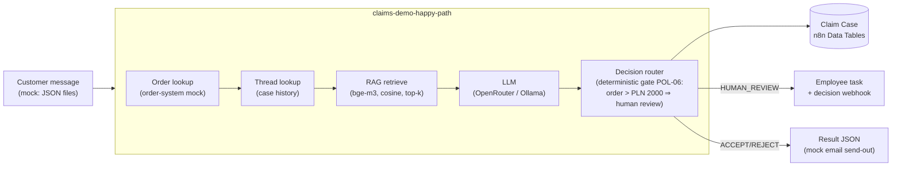

# n8n Claims Automation — AI-powered complaint handling engine

> **🇵🇱 Wersja polska:** [README.md](README.md)

A demonstration **e-commerce complaint automation engine** built entirely on
[n8n](https://n8n.io): LLM-based triage and resolution, human-in-the-loop,
RAG over policies and precedents, and **two independent evaluation paths**
with metrics and A/B experiments.

The project covers the full engineering cycle: domain design → test dataset
authored by an isolated agent → walking skeleton → layered features (Claim
Case history, human review, follow-ups, RAG) → evaluation → experiments.

## Results

| Run | Configuration | Harness | Decision accuracy |
|---|---|---|---|
| #1 | full knowledge base, before dataset fix | batch-eval | 92.5% |
| #2 | + order lookup (enrichment from order system) | batch-eval | 95% |
| #3 | final baseline: full knowledge base | batch-eval | **95%** (38/40, 0 TECHNICAL_FAIL) |
| #4 | classical RAG, top-6 | n8n native Evaluations | 82.5% |
| #5 | classical RAG, top-10 | batch-eval | 82.5% |

Run artifacts: [`datasets/outbox/`](datasets/outbox/) (`eval-run-*.json`),
change log: [`datasets/CHANGES.md`](datasets/CHANGES.md) (Polish).

### Experiment takeaways

- **Classical RAG costs ~12 p.p. of accuracy vs the full knowledge base**
  (95% → 82.5%) — on a knowledge base small enough to fit entirely in the
  context window.
- **Widening retrieval from top-6 to top-10 changed nothing** (82.5% → 82.5%).
  Context width was not the bottleneck; recurring mistakes affect the same
  borderline cases (model variance), not missing rules in the prompt.
- Evaluation also surfaced a dataset defect (run #1): ground truth assumed facts
  the customer never provided. The fix was architectural — an order-system mock
  enriching each case before LLM reasoning — not patching expected decisions.

Detailed analysis: [`docs/EKSPERYMENTY.md`](docs/EKSPERYMENTY.md) (Polish).

## Architecture



Key design decisions:

- **Decision router with deterministic gates** — business thresholds (e.g. order
  value) enforced in code regardless of the model recommendation. The LLM
  recommends; it does not decide everything.
- **Claim Case history in Data Tables** — every case appends a row (status,
  confidence, gate_reason, model); follow-ups read prior resolutions.
- **Human review** — flagged cases become employee tasks; the human decision
  returns via `POST /webhook/claims-demo-decision`.
- **Follow-ups/appeals** — a message with `thread_case_id` is judged with full
  case history; appeals always go to a human (policy POL-09).
- **Two evaluation paths**: custom batch-eval (webhook → 40 sequential cases →
  accuracy report with PASS/WARNING/FAIL thresholds) and native n8n Evaluations
  (Evaluation Trigger + Evaluation node writing per-case results to a Data Table).

## Repository layout

```
├── workflows/          # 5 importable n8n workflow JSONs
│   ├── claims-demo-happy-path.json    # core: single case end-to-end (35 nodes)
│   ├── claims-demo-batch-eval.json    # 40 cases through happy path + report
│   ├── claims-demo-report.json        # accuracy report without an LLM call
│   ├── claims-demo-eval-native.json   # native n8n Evaluations path
│   └── claims-demo-human-decision.json
├── datasets/
│   ├── inbox/          # 40 mock customer complaints (CASE-0001..0040)
│   ├── expected/       # per-case ground truth (+ all.json)
│   ├── orders.json     # order-system mock used for enrichment
│   └── CHANGES.md      # dataset & environment change log
├── knowledge/
│   ├── policies.json         # 12 policy rules (POL-01..12)
│   ├── precedent-cases.json  # 10 precedent cases (PREC-01..10)
│   └── embeddings.json       # bge-m3 vectors (1024d) for RAG
├── docs/
│   ├── EKSPERYMENTY.md # experiment methodology & results (Polish)
│   └── MODELE.md       # LLM selection notes
└── narzedzia/          # helper scripts (result export, MCP client)
```

The dataset was authored by an **isolated agent** (no knowledge of the
implementation), so test cases are not biased by familiarity with the solution.

## Reproducing

1. n8n instance ≥ 2.x (tested on 2.36.5).
2. Import workflows from `workflows/` via UI or API/MCP.
3. Create an `httpHeaderAuth` credential with your OpenRouter key (or point at a
   local Ollama: `/v1/chat/completions`, set `api_url` in the Config node).
4. Copy `datasets/` + `knowledge/` into a directory n8n can read
   (`N8N_RESTRICT_FILE_ACCESS_TO`) — paths live in the Config node.
5. Trigger the evaluation:
   ```bash
   curl -X POST https://<your-n8n>/webhook/claims-demo-eval -d '{}'
   ```
   The report lands in `outbox/eval-report.json`.

Note an n8n 2.x breaking change: Code nodes no longer receive file content in
`binary.data.data` (only a `filesystem-v2` marker) — file reads go through the
Extract from File node. The workflows in this repo are already migrated.

## Roadmap

- Always-append fallback policy (POL-12) regardless of retrieval results
- Automated regression: baseline + thresholds on every prompt change
- Chunkless RAG (retrieval over structured fields instead of text chunks)

---

*Hobby/portfolio project. All data (customers, orders, policies) is fictional and
generated for demo purposes.*
