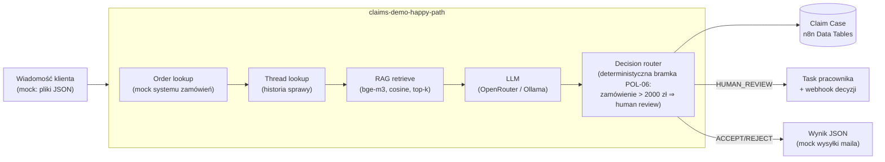

# n8n Claims Automation — silnik obsługi reklamacji z AI

> **🇬🇧 English version:** [README.en.md](README.en.md)

Demonstracyjny **silnik automatyzacji obsługi reklamacji e-commerce** zbudowany w całości
na [n8n](https://n8n.io): klasyfikacja i rozstrzyganie zgłoszeń przez LLM, human-in-the-loop,
RAG po regulaminie i precedensach oraz **dwie niezależne ścieżki ewaluacji** z metrykami
i eksperymentami A/B.

Projekt pokazuje pełny cykl inżynierski: projekt domeny → dataset testowy tworzony
izolowanym agentem → walking skeleton → warstwy (Claim Case, human review, follow-upy,
RAG) → ewaluacja → eksperymenty → regresja.

## Po co to badanie?

Silnik czyta wiadomość klienta, sprawdza ją z regulaminem sklepu i podejmuje jedną
z trzech decyzji: **zaakceptuj**, **odrzuć** albo **przekaż człowiekowi**. Samo
„workflow działa" nie znaczy jednak nic — kluczowe pytanie brzmi: **czy decyzje są
zgodne z regulaminem?** Dlatego powstały 40 przykładowych reklamacji z zadaną
prawidłową odpowiedzią, a projekt mierzy, jak często silnik decyduje tak samo jak
człowiek znający zasady.

Trzy pytania badawcze:

1. Czy AI podejmuje decyzje zgodne z regulaminem, gdy zna go w całości?
2. Czy wystarczy podawać AI tylko dopasowane fragmenty regulaminu (technika RAG —
   tak robi się w dużych firmach, gdzie cała dokumentacja nie mieści się w promptcie)?
3. Czy podanie większej liczby fragmentów (6 → 10) poprawia wynik?

## Wyniki

| Co wiedziało AI przy decyzji | Wynik |
|---|---|
| Cały regulamin (12 zasad + 10 precedensów) | **95%** (38/40) |
| Tylko 6 najbardziej pasujących fragmentów (RAG) | 82,5% (33/40) |
| Tylko 10 najbardziej pasujących fragmentów (RAG) | 85% (34/40) |

Artefakty runów: [`datasets/outbox/`](datasets/outbox/) (`eval-run-*.json`),
dziennik zmian: [`datasets/CHANGES.md`](datasets/CHANGES.md).

### Wnioski

1. **AI dobrze rozstrzyga reklamacje, gdy zna cały regulamin** — 95% zgodności
   z odpowiedziami wzorcowymi. Pomyłki zdarzają się głównie w przypadkach
   granicznych, gdzie nawet człowiek mógłby się wahać.

2. **Podawanie samych fragmentów regulaminu (RAG) pogarsza jakość o ok. 10 punktów
   procentowych.** Przy tym regulaminie nic to nie daje: skoro całość mieści się
   w promptcie, wycinanie fragmentów może tylko zaszkodzić — system potrafi nie
   dosłać reguły, która okazałaby się potrzebna.

3. **Większa liczba fragmentów nie pomaga.** Top-6 i top-10 dają praktycznie ten
   sam wynik, więc problemem nie jest „za mało kontekstu".

4. **Powtarzające się pomyłki dotyczą zawsze tych samych kilku spraw graniczych**
   — raz AI jest ostrożniejsze, raz mniej. To normalna zmienność modelu, dlatego
   wnioski opieram na powtarzających się wzorcach, nie na pojedynczym wyniku.

5. **Testy wychwyciły też błąd w samych danych wejściowych.** Pierwszy run pokazał,
   że część reklamacji nie zawiera informacji potrzebnych do decyzji (np. ceny
   towaru) — choć realnie klient by ich nie podał. Naprawa jak w prawdziwej firmie:
   silnik uzupełnia dane z systemu zamówień, zamiast „poprawiać" oczekiwane odpowiedzi.

Szczegółowa analiza: [`docs/EKSPERYMENTY.md`](docs/EKSPERYMENTY.md)
([English](docs/EKSPERYMENTY.en.md)).

## Architektura



Kluczowe elementy:

- **Decision router z deterministycznymi bramkami** — progi biznesowe (np. wartość
  zamówienia) wymuszane z kodu, niezależnie od rekomendacji modelu. LLM rekomenduje,
  ale nie decyduje o wszystkim.
- **Claim Case w Data Tables** — każda sprawa dopisuje wiersz z historią (status,
  confidence, gate_reason, model), follow-upy czytają wcześniejsze rozstrzygnięcia.
- **Human review** — sprawa trafia do tasku pracownika; decyzja człowieka wraca webhookiem
  `POST /webhook/claims-demo-decision`.
- **Follow-upy/apelacje** — wiadomość z `thread_case_id` rozpatrywana z historią sprawy;
  apelacje kierowane tylko do człowieka (POL-09).
- **Dwie ścieżki ewaluacji**: własny batch-eval (webhook → 40 spraw sekwencyjnie → raport
  accuracy z progami PASS/WARNING/FAIL) oraz natywny mechanizm n8n Evaluations
  (Evaluation Trigger + node Evaluation zapisujący per-przypadek do Data Table).

## Zawartość repo

```
├── workflows/          # 5 workflowów n8n (JSON, importowalne)
│   ├── claims-demo-happy-path.json    # rdzeń: 1 sprawa end-to-end (35 nodów)
│   ├── claims-demo-batch-eval.json    # 40 spraw przez happy path + raport
│   ├── claims-demo-report.json        # raport accuracy bez LLM-a
│   ├── claims-demo-eval-native.json   # natywna ewaluacja n8n Evaluations
│   └── claims-demo-human-decision.json
├── datasets/
│   ├── inbox/          # 40 mockowych zgłoszeń klientów (CASE-0001..0040)
│   ├── expected/       # ground truth per przypadek (+ all.json)
│   ├── orders.json     # mock systemu zamówień (wzbogacenie sprawy)
│   └── CHANGES.md      # dziennik zmian datasetu i środowiska
├── knowledge/
│   ├── policies.json         # 12 reguł regulaminu (POL-01..12)
│   ├── precedent-cases.json  # 10 precedensów (PREC-01..10)
│   └── embeddings.json       # wektory bge-m3 (1024d) dla RAG
├── docs/
│   ├── EKSPERYMENTY.md # metodologia i wyniki eksperymentów
│   ├── EKSPERYMENTY.en.md # to samo po angielsku
│   └── MODELE.md       # notatki dot. wyboru modeli LLM
└── narzedzia/          # skrypty pomocnicze (eksport wyników, MCP client)
```

Dataset został wygenerowany przez **izolowanego agenta** (bez wiedzy o implementacji),
żeby przypadki testowe nie były „nacechowane" znajomością rozwiązania.

## Jak odtworzyć

1. Instancja n8n ≥ 2.x (testowane na 2.36.5), SQLite lub Postgres.
2. Zaimportuj workflowy z `workflows/` przez UI albo n8n API/MCP.
3. Utwórz credential `httpHeaderAuth` z kluczem OpenRouter (albo wskaż lokalną Ollamę:
   endpoint `/v1/chat/completions`, pole `api_url` w nodzie Config).
4. Skopiuj `datasets/` + `knowledge/` do katalogu czytanego przez n8n
   (env `N8N_RESTRICT_FILE_ACCESS_TO`) — ścieżki w nodzie Config.
5. Uruchom `claims-demo-batch-eval` webhookiem:
   ```bash
   curl -X POST https://<twoj-n8n>/webhook/claims-demo-eval -d '{}'
   ```
   Raport pojawi się jako `outbox/eval-report.json`.

Uwaga na breaking change n8n 2.x: Code node nie dostaje treści pliku w
`binary.data.data` (tylko marker `filesystem-v2`) — odczyt plików idzie przez
node Extract from File. Workflowy w tym repo są już po migracji.

## Dokąd to można rozwinąć

**Eksperymenty następcze**

- **Chunkless RAG** — dobór reguł po polach strukturalnych (kategoria reklamacji,
  wartość zamówienia, termin) zamiast podobieństwa tekstu. Hipoteza: odbuduje jakość
  klasycznego RAG-u do poziomu pełnej bazy i jest realna do wdrożenia produkcyjnego.
- **Skalowanie badania** — regulamin wzorowany na realnych sklepach (~50 reguł)
  + dataset 100+ przypadków generowany izolowanym agentem. Dopiero przy dużej bazie
  porównanie „pełna baza vs RAG" jest uczciwe — wtedy pełny regulamin przestaje się
  mieścić w promptcie i RAG ma szansę pokazać realne korzyści (koszt tokenów,
  opóźnienie), a nie tylko spadek jakości.

**Rozszerzenia silnika**

- **Analiza zdjęć (multimodal)** — klient zgłasza uszkodzenie, ale nie dołączył
  zdjęcia → automatyczna prośba o dowód zamiast pełnej ścieżki decyzyjnej;
  zdjęcie obecne → weryfikacja, czy faktycznie pokazuje opisany defect.
- **Ścieżka szybka dla powtarzalnych spraw** — klasyfikator wstępny: proste,
  powtarzalne przypadki idą skróconą ścieżką bez pełnego rozumowania LLM-a;
  nietypowe → pełna analiza.
- **Automatyczna regresja** — baseline + progi PASS/WARNING/FAIL uruchamiane po
  każdej zmianie promptu lub reguł, jak testy jednostkowe dla AI.

---

*Projekt hobbystyczny/portfolio. Wszystkie dane (klienci, zamówienia, regulamin) są
fikcyjne i wygenerowane na potrzeby demo.*
