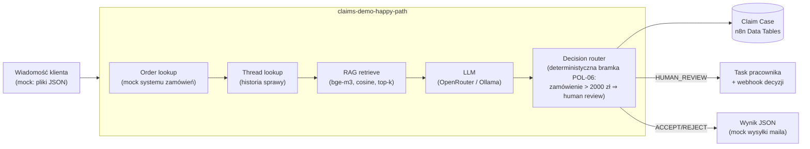

# n8n Claims Automation — silnik obsługi reklamacji z AI

> **🇬🇧 English version:** [README.en.md](README.en.md)

Demonstracyjny **silnik automatyzacji obsługi reklamacji e-commerce** zbudowany w całości
na [n8n](https://n8n.io): klasyfikacja i rozstrzyganie zgłoszeń przez LLM, human-in-the-loop,
RAG po regulaminie i precedensach oraz **dwie niezależne ścieżki ewaluacji** z metrykami
i eksperymentami A/B.

Projekt pokazuje pełny cykl inżynierski: projekt domeny → dataset testowy tworzony
izolowanym agentem → walking skeleton → warstwy (Claim Case, human review, follow-upy,
RAG) → ewaluacja → eksperymenty → regresja.

## Wyniki

| Run | Konfiguracja | Harness | Decision accuracy |
|---|---|---|---|
| #1 | pełna baza wiedzy, przed naprawą datasetu | batch-eval | 92,5% |
| #2 | + Order lookup (dane z systemu zamówień) | batch-eval | 95% |
| #3 | finalny baseline: pełna baza wiedzy | batch-eval | **95%** (38/40, 0 TECHNICAL_FAIL) |
| #4 | klasyczny RAG, top-6 | eval-native (n8n Evaluations) | 82,5% |
| #5 | klasyczny RAG, top-10 | batch-eval | 82,5% |

Artefakty runów: [`datasets/outbox/`](datasets/outbox/) (`eval-run-*.json`),
dziennik zmian: [`datasets/CHANGES.md`](datasets/CHANGES.md).

### Wnioski z eksperymentów

- **RAG kosztuje ~12 p.p. accuracy wobec pełnej bazy wiedzy** (95% → 82,5%) przy bazie
  tak małej, że mieści się w całości w oknie kontekstowym.
- **Zwiększenie okna retrievalu z top-6 do top-10 nie zmieniło nic** (82,5% → 82,5%).
  Szerokość kontekstu nie była wąskim gardłem — powtarzające się błędy dotyczą tych samych
  przypadków brzegowych (model raz ostrożny, raz nie), a nie braku reguł w promptcie.
- Ewaluacja ujawniła też defekt datasetu (run #1): ground truth zakładał dane, których
  klient nie podał. Naprawa była architektoniczna — mock systemu zamówień wzbogacający
  sprawę przed rozumowaniem LLM — a nie łatanie oczekiwanych decyzji.

Szczegółowa analiza: [`docs/EKSPERYMENTY.md`](docs/EKSPERYMENTY.md).

## Architektura



Kluczowe elementy:

- **Decision router z deterministycznymi bramkami** — progi biznesowe (np. wartość
  zamówienia) wymuszane z kodu, niezależnie od rekomendacji modelu. LLM rekomenduje,
  ale nie decyduje o wszystkim.
- **Claim Case w Data Tables** — każda sprawa dopisuje wiersz z historią (status,
  confidence, gate_reason, model), follow-upy czytają wcześniejsze rozstrzygnięcia.
- **Human review** — sprawa trafia do tasku pracownika; decyzja człowieka wraca webhookiem
  `POST /webhook/claims-demo-decision`.
- **Follow-upy/apelacje** — wiadomość z `thread_case_id` rozpatrywana z historią sprawy;
  apelacje kierowane tylko do człowieka (POL-09).
- **Dwie ścieżki ewaluacji**: własny batch-eval (webhook → 40 spraw sekwencyjnie → raport
  accuracy z progami PASS/WARNING/FAIL) oraz natywny mechanizm n8n Evaluations
  (Evaluation Trigger + node Evaluation zapisujący per-przypadek do Data Table).

## Zawartość repo

```
├── workflows/          # 5 workflowów n8n (JSON, importowalne)
│   ├── claims-demo-happy-path.json    # rdzeń: 1 sprawa end-to-end (35 nodów)
│   ├── claims-demo-batch-eval.json    # 40 spraw przez happy path + raport
│   ├── claims-demo-report.json        # raport accuracy bez LLM-a
│   ├── claims-demo-eval-native.json   # natywna ewaluacja n8n Evaluations
│   └── claims-demo-human-decision.json
├── datasets/
│   ├── inbox/          # 40 mockowych zgłoszeń klientów (CASE-0001..0040)
│   ├── expected/       # ground truth per przypadek (+ all.json)
│   ├── orders.json     # mock systemu zamówień (wzbogacenie sprawy)
│   └── CHANGES.md      # dziennik zmian datasetu i środowiska
├── knowledge/
│   ├── policies.json         # 12 reguł regulaminu (POL-01..12)
│   ├── precedent-cases.json  # 10 precedensów (PREC-01..10)
│   └── embeddings.json       # wektory bge-m3 (1024d) dla RAG
├── docs/
│   ├── EKSPERYMENTY.md # metodologia i wyniki eksperymentów
│   └── MODELE.md       # notatki dot. wyboru modeli LLM
└── narzedzia/          # skrypty pomocnicze (eksport wyników, MCP client)
```

Dataset został wygenerowany przez **izolowanego agenta** (bez wiedzy o implementacji),
żeby przypadki testowe nie były „nacechowane" znajomością rozwiązania.

## Jak odtworzyć

1. Instancja n8n ≥ 2.x (testowane na 2.36.5), SQLite lub Postgres.
2. Zaimportuj workflowy z `workflows/` przez UI albo n8n API/MCP.
3. Utwórz credential `httpHeaderAuth` z kluczem OpenRouter (albo wskaż lokalną Ollamę:
   endpoint `/v1/chat/completions`, pole `api_url` w nodzie Config).
4. Skopiuj `datasets/` + `knowledge/` do katalogu czytanego przez n8n
   (env `N8N_RESTRICT_FILE_ACCESS_TO`) — ścieżki w nodzie Config.
5. Uruchom `claims-demo-batch-eval` webhookiem:
   ```bash
   curl -X POST https://<twoj-n8n>/webhook/claims-demo-eval -d '{}'
   ```
   Raport pojawi się jako `outbox/eval-report.json`.

Uwaga na breaking change n8n 2.x: Code node nie dostaje treści pliku w
`binary.data.data` (tylko marker `filesystem-v2`) — odczyt plików idzie przez
node Extract from File. Workflowy w tym repo są już po migracji.

## Co dalej (roadmapa)

- Doklejanie reguły fallback (POL-12) do promptu niezależnie od retrievalu
- Regresja automatyczna: baseline + progi + uruchomienie po każdej zmianie promptu
- Chunkless RAG (retriewal po ustrukturyzowanych polach zamiast fragmentów tekstu)

---

*Projekt hobbystyczny/portfolio. Wszystkie dane (klienci, zamówienia, regulamin) są
fikcyjne i wygenerowane na potrzeby demo.*
